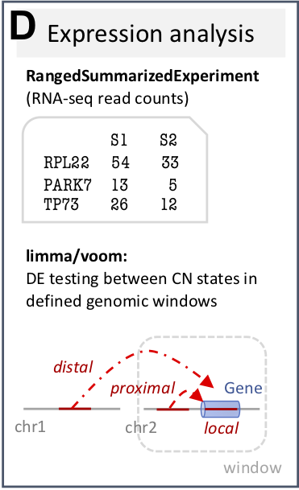
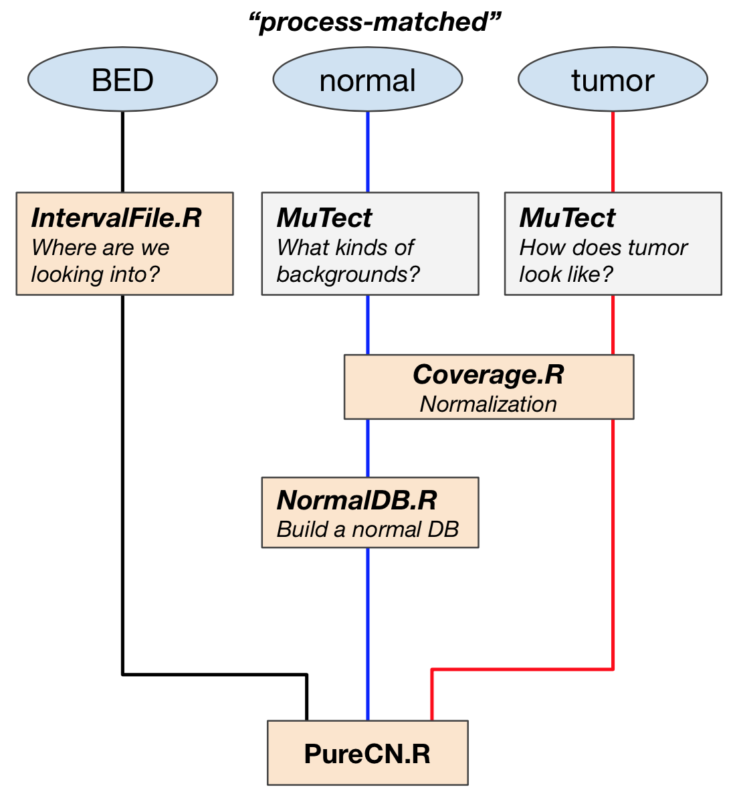
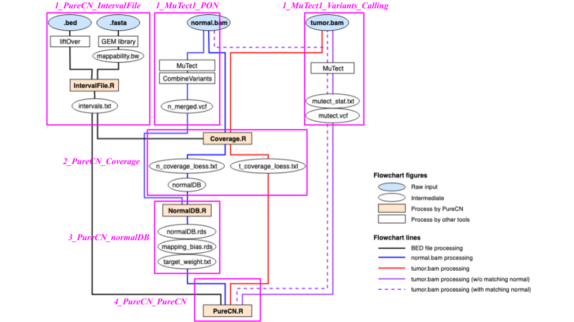

# Copy number variation analysis with Bioconductor

```{r, include=FALSE}
library(knitr)
opts_chunk$set(out.width="100%", cache=TRUE)
```

## Workshop information

### Instructor(s) name(s) and contact information

Ludwig Geistlinger, Marcel Ramos, Sehyun Oh, and Levi Waldron

CUNY School of Public Health
55 W 125th St, New York, NY 10027

Ludwig_Geistlinger@hms.harvard.edu<\br>
Marcel.Ramos@sph.cuny.edu<\br>
Sehyun.Oh@sph.cuny.edu<\br>
Levi.Waldron@sph.cuny.edu

### Workshop Description

This workshop gives an overview of Bioconductor solutions for the analysis of 
copy number variation (CNV) data. 
The workshop introduces Bioconductor core data structures for efficient 
representation, access, and manipulation of CNV data, and how to use these
containers for structured downstream analysis of CNVs and integration with gene 
expression and quantitative phenotypes. 
Participants will be provided with code and hands-on practice for a comprehensive 
set of typical analysis steps including exploratory analysis, summarizing individual 
CNV calls across a population, overlap analysis with functional genomic regions 
and regulatory elements, expression quantitative trait loci (eQTL) analysis, 
and genome-wide association analysis (GWAS) with quantitative phenotypes.
As an advanced application example, the workshop also introduces allele-specific 
absolute copy number analysis and how it is incorporated in genomic cancer analysis 
for the estimation of tumor characteristics such as tumor purity and ploidy. 


### Pre-requisites

* Basic knowledge of R syntax
* Familiarity with the SummarizedExperiment class
* Familiarity with the GenomicRanges class

* Familiarity with high-throughput genomic assays such as microarrays and 
  next-generation sequencing
* Familiarity with the biological definition of single nucleotide polymorphism 
  (SNP) and copy number variation (CNV) 

### Workshop Participation

Execution of example code and hands-on practice

### _R_ / _Bioconductor_ packages used

* [RaggedExperiment](http://bioconductor.org/packages/RaggedExperiment)
* [CNVRanger](http://bioconductor.org/packages/CNVRanger)
* [regioneR](http://bioconductor.org/packages/regioneR)
* [PureCN](http://bioconductor.org/packages/PureCN)

### Time outline

| Activity                                              | Time |
|-------------------------------------------------------|------|
| Overview                                              | 5m   |
| Data representation and manipulation                  | 20m  |
| Integrative downstream analysis (eQTL, GWAS, ...)     | 20m  |
| Allele-specific CN analysis in cancer                 | 15m  |


### Learning Goals

* get familiar with elementary concepts of CNV analysis
* learn how to efficiently represent, access, and manipulate CNV data 
  in Bioconductor data structures
* get familiar with different strategies for summarizing individual CNV
  calls across a population
* learn how to assess the significance of overlaps between CNVs and functional
  genomic regions
* learn how carry out association analysis with gene expression and quantitative
  phenotypes
* get familiar with allele-specific absolute CN analysis of genomic cancer data 
 
### Specific objectives

* understand how CNVs can be experimentally detected and computationally inferred
  from SNP arrays and next-generation sequencing data
* learn how to use `GRangesList` and `RaggedExperiment` to represent, access, and 
  manipulate CNV data 
* understand different strategies for finding recurrent CNV regions in a population,
  including density trimming, reciprocal overlap, and recurrence significance estimation
* learn how to use the [regioneR](http://bioconductor.org/packages/regioneR) package
  to assess the significance of overlaps between CNVs and functional genomic regions
  such as genes, promoters, and enhancers.
* learn how to carry out eQTL analysis for CNV and RNA-seq data
* learn how to carry out a GWAS analysis for CNV and quantitative phenotype data
* learn how to estimate tumor purity and ploidy from absolute CN analysis with 
  [PureCN](http://bioconductor.org/packages/PureCN)

## Overview

```{r setup,include=TRUE,results="hide",message=FALSE,warning=FALSE}
library(CNVRanger)
library(AnnotationHub)
library(regioneR)
library(BSgenome.Btaurus.UCSC.bosTau6.masked)
library(SummarizedExperiment)
library(curatedTCGAData)
library(TCGAutils)
library(RaggedExperiment)
```

Copy number variation (CNV) is a frequently observed deviation from the diploid 
state due to duplication or deletion of genomic regions.
CNVs can be experimentally detected based on comparative genomic hybridization, 
and computationally inferred from SNP-arrays or next-generation sequencing data.
These technologies for CNV detection have in common that they report, for each
sample under study, genomic regions that are duplicated or deleted with respect
to a reference.
Such regions are denoted as _CNV calls_ in the following and will be considered
the starting point for analysis.

Relevant literature:

da Silva V, Ramos M, Groenen M, Crooijmans R, Johansson A, Regitano L, Coutinho L,
Zimmer R, Waldron L, Geistlinger L.
[CNVRanger: association analysis of CNVs with gene expression and quantitative phenotypes](https://doi.org/10.1093/bioinformatics/btz632).
_Bioinformatics_, 36(3):972-3, 2020.

Oh S, Geistlinger L, Ramos M, Morgan M, Waldron L, Riester M.
[Reliable analysis of clinical tumor-only whole-exome sequencing data](https://doi.org/10.1200/CCI.19.00130).
_JCO Clin Cancer Inform_, 4:321-35, 2020.

Geistlinger L, Oh S, Ramos M, Schiffer L, LaRue R, Henzler C, Munro S, Daughters C,
Nelson A, Winterhoff B, Chang Z, Talukdar S, Shetty M, Mullaney S, Morgan M,
Parmigiani G, Birrer M, Qin LX, Riester M, Starr T, Waldron L.
[Multi-omic analysis of subtype evolution and heterogeneity in high-grade serous ovarian carcinoma](https://doi.org/10.1101/554394).
_Cancer Research_, 2020.


## Representation and manipulation of CNV data with RaggedExperiment

`RaggedExperiment` is a flexible data representation for segmented copy number,
somatic mutations such as represented in `.vcf` files, and other ragged array
schema for genomic location data.  Like the `GRangesList` class from
`GenomicRanges`, `RaggedExperiment` can be used to represent _differing_
genomic ranges on each of a set of samples. In fact, `RaggedExperiment`
contains a `GRangesList`:

```{r}
showClass("RaggedExperiment")
```

### Importing ranged data with `GenomicRanges`

When importing data from a file, you can represent an imported table (usually
`data.frame`) with genomic information using helper functions in
`GenomicRanges`:

```{r,eval = FALSE}
library(GenomicRanges)
makeGRangesFromDataFrame(...)
makeGRangesListFromData(...)
```

### Constructing a `RaggedExperiment` object

We start with a toy example of two `GRanges` objects, providing ranges on two
chromosomes in two samples:

```{r}
sample1 <- GRanges(
    c(A = "chr1:1-10:-", B = "chr1:8-14:+", C = "chr1:15-18:+"),
    score = 3:5, type=c("germline", "somatic", "germline"))
sample2 <- GRanges(
    c(D = "chr1:1-10:-", E = "chr1:11-18:+"),
    score = 11:12, type=c("germline", "somatic"))
```

Include column data `colData` to describe the samples:

```{r}
colDat <- DataFrame(id=1:2, status = factor(c("control", "case")))
```

The `RaggedExperiment` can be constructed from individual `Granges`:

```{r}
(ragexp <- RaggedExperiment(
    sample1 = sample1,
    sample2 = sample2,
    colData = colDat))
```

Or from a `GRangesList`:

```{r}
grl <- GRangesList(sample1=sample1, sample2=sample2)
ragexp2 <- RaggedExperiment(grl, colData = colDat)
identical(ragexp, ragexp2)
```

Note that the original ranges are is represented as the `rowRanges` of the
`RaggedExperiment`:

```{r}
rowRanges(ragexp)
```


### `*Assay` functions

`RaggedExperiment` provides a flexible set of _*Assay_ methods to
support transformation of data to matrix format with varying row dimensions.

```{r, echo=FALSE, fig.cap="RaggedExperiment object schematic. Rows and columns represent genomic ranges and samples, respectively. Assay operations can be performed with (from left to right) compactAssay, qreduceAssay, and sparseAssay.", out.width="\\maxwidth"}
knitr::include_graphics("RaggedExperiment.png")
```

The four main _Assay_ functions for converting to matrix are:

* [sparseAssay](#sparseassay): leave ranges exactly as-is
* [compactAssay](#compactassay): combine identical ranges
* [disjoinAssay](#disjoinassay): disjoin ranges that overlap across samples
* [qreduceAssay](#qreduceassay): find overlaps with provided "query" ranges

These each have a corresponding function for conversion to [RangedSummarizedExperiment](#Conversion to RangedSummarizedExperiment).

#### sparseAssay

The most straightforward matrix representation of a `RaggedExperiment` will
return a matrix with the number of rows equal to the total number of ranges defined across all
samples. *i.e.* the 5 rows of the `sparseAssay` result:

```{r}
sparseAssay(ragexp)
```

correspond to the ranges of the unlisted `GRangesList`:

```{r}
unlist(grl)
```

The rownames of the `sparseAssay` result are equal to the names of the `GRanges` elements.
The values in the matrix returned by `sparseAssay` correspond to the first columns of the
`mcols` of each `GRangesList` element, in this case the "score" column.

Note, this is the default `assay()` method of `RaggedExperiment`:
```{r}
assay(ragexp, "score")
assay(ragexp, "type")
```

#### compactAssay

The dimensions of the `compactAssay` result differ from that of the `sparseAssay` result only
if there are identical ranges in different samples. Identical ranges are placed in the same row in
the output. Ranges with any difference in start, end, or strand, will be
kept on different rows. Non-disjoint ranges are **not** collapsed.

```{r}
compactAssay(ragexp)
compactAssay(ragexp, "type")
```

Note that row names are constructed from the ranges, and the names of the `GRanges` vectors are
lost, unlike in the `sparseAssay` result.

#### disjoinAssay

This function is similar to `compactAssay` except the rows are _disjoint_[^9]
ranges. Elements of the matrix are summarized by applying the `simplifyDisjoin`
functional
argument to assay values of overlapping ranges.

```{r}
disjoinAssay(ragexp, simplifyDisjoin = mean)
```

[^9]: A _disjoint_ set of ranges has no overlap between any ranges of the set.

#### qreduceAssay

The `qreduceAssay` function is the most complicated but likely the most useful of the `RaggedExperiment`
*Assay* functions. It requires you to provide a `query` argument that is a `GRanges` vector, and
the rows of the resulting matrix correspond to the elements of this `GRanges`. The returned matrix will have
dimensions `length(query)` by `ncol(x)`. Elements of the resulting matrix correspond to the overlap of the
_i_ th `query` range in the _j_ th sample, summarized according to the `simplifyReduce` functional argument.
This can be useful, for example, to calculate per-gene copy number or mutation status by providing
the genomic ranges of every gene as the `query`.

The `simplifyReduce` argument in `qreduceAssay` allows the user to summarize
overlapping regions with a custom method for the given "query" region of
interest. We provide one for calculating a weighted average score per
query range, where the weight is proportional to the overlap widths between
overlapping ranges and a query range.

_Note_ that there are three arguments to this function. See the documentation
for additional details.

```{r}
weightedmean <- function(scores, ranges, qranges)
{
    isects <- pintersect(ranges, qranges)
    sum(scores * width(isects)) / sum(width(isects))
}
```

The call to `qreduceAssay` calculates the overlaps between the ranges of each sample:
```{r}
grl
```

with the query ranges (an arbitrary set is defined here for demonstration):
First create a demonstration "query" region of interest:
```{r}
(query <- GRanges(c("chr1:1-14:-", "chr1:15-18:+")))
```

using the `simplifyReduce` function to resolve overlapping ranges and return a matrix with rows
corresponding to the query:
```{r}
qreduceAssay(ragexp, query, simplifyReduce = weightedmean)
```

### Conversion to RangedSummarizedExperiment

These methods all have corresponding methods to return a `RangedSummarizedExperiment` and preserve the `colData`:
```{r, results='hide'}
sparseSummarizedExperiment(ragexp)
compactSummarizedExperiment(ragexp)
disjoinSummarizedExperiment(ragexp, simplify = mean)
qreduceSummarizedExperiment(ragexp, query = query, simplify = weightedmean)
```

Please see the `RaggedExperiment` vignette for
[more details](http://www.bioconductor.org/packages/release/bioc/vignettes/RaggedExperiment/inst/doc/RaggedExperiment.html).

## Integrative downstream analysis of CNVs with CNVRanger

```{r, echo=FALSE}
knitr::include_graphics("CNVRanger.png")
```

**(A)** The [CNVRanger](http://bioconductor.org/packages/CNVRanger) package
imports CNV calls from a simple file format into 
`R`, and stores them in dedicated Bioconductor data structures, and 
**(B)** implements three frequently used approaches for summarizing CNV calls 
across a population: 
_(i)_ the [CNVRuler](http://www.ircgp.com/CNVRuler)
that trims region margins based on regional density
[Kim et al., 2012](https://doi.org/10.1093/bioinformatics/bts239), 
_(ii)_ the reciprocal overlap procedure that requires sufficient mutual overlap 
between calls 
[Conrad et al., 2010](https://doi.org/10.1038/nature08516), and
_(iii)_ the [GISTIC](http://www.broadinstitute.org/cancer/cga/gistic) procedure 
that identifies recurrent CNV regions
[Beroukhim et al., 2007](https://doi.org/10.1073/pnas.0710052104).
**(C)** `CNVRanger` builds on [regioneR](http://bioconductor.org/packages/regioneR) 
for overlap analysis of CNVs with functional genomic regions, 
**(D)** implements RNA-seq expression Quantitative Trait Loci (eQTL) analysis 
for CNVs by interfacing with [edgeR](http://bioconductor.org/packages/edgeR), and 
**(E)** interfaces with
[PLINK](http://zzz.bwh.harvard.edu/plink) for traditional
genome-wide association studies (GWAS) between CNVs and quantitative phenotypes.

The key parts of the functionality implemented in `CNVRanger` were developed,
described, and applied in several previous studies:

- Genome-wide detection of CNVs and their association with meat tenderness in 
    Nelore cattle
    [da Silva et al., 2016](https://doi.org/10.1371/journal.pone.0157711)

- Widespread modulation of gene expression by copy number variation in skeletal 
    muscle
    [Geistlinger et al., 2018](https://doi.org/10.1038/s41598-018-19782-4)

- CNVs are associated with genomic architecture in a songbird 
    [da Silva et al., 2018](https://doi.org/10.1186/s12864-018-4577-1)

### Reading and accessing CNV data

```{r input, echo=FALSE, fig.wide=TRUE}
knitr::include_graphics("Input.png")
```

`CNVRanger` uses Bioconductor core data structures 
implemented in the [GenomicRanges](http://bioconductor.org/packages/GenomicRanges) 
and [RaggedExperiment](http://bioconductor.org/packages/RaggedExperiment) 
packages to represent, access, and manipulate CNV data.

We start by loading the package.

```{r lib}
library(CNVRanger)
```

#### Input data format

`CNVRanger` reads CNV calls from a simple file format, providing at 
least chromosome, start position, end position, sample ID, and integer copy number 
for each call.

For demonstration, we consider CNV calls as obtained with 
[PennCNV](http://penncnv.openbioinformatics.org) from SNP-chip data in a 
Brazilian cattle breed 
([da Silva et al., 2016](https://doi.org/10.1371/journal.pone.0157711)).

Here, we use a data subset and only consider CNV calls on chromosome 1 and 2,
for which there are roughly 3000 CNV calls as obtained for 711 samples. 
We use `read.csv` to read comma-separated values, but we could use a different
function if the data were provided with a different delimiter
(for example, `read.delim` for tab-separated values).

```{r readCalls}
data.dir <- system.file("extdata", package="CNVRanger")
call.file <- file.path(data.dir, "Silva16_PONE_CNV_calls.csv")
calls <- read.csv(call.file, as.is=TRUE)
nrow(calls)
head(calls)
```

```{r nrSamples}
length(unique(calls[,"NE_id"]))
```

We observe that this example dataset satisfies the basic five-column input format 
required by `CNVRanger`.

The last column contains the integer copy
number state for each call, encoded as

- `0`: homozygous deletion (2-copy loss)
- `1`: heterozygous deletion (1-copy loss)
- `2`: normal diploid state
- `3`: 1-copy gain
- `4`: amplification (>= 2-copy gain)

#### Representation as a `GRangesList`

Once read into an R `data.frame`, we group the calls by sample ID and convert 
them to a `GRangesList`.
Each element of the list corresponds to a sample, and contains the genomic 
coordinates of the CNV calls for this sample (along with the copy number state 
in the `state` metadata column).  

```{r cnvCalls}
grl <- makeGRangesListFromDataFrame(calls, 
    split.field = "NE_id", keep.extra.columns = TRUE)
grl
```

The advantage of representing the CNV calls as a `GRangesList` is that it allows
to leverage the comprehensive set of operations on genomic regions implemented 
in the `GenomicRanges` package - for instance, sorting of the calls 
according to their genomic coordinates.

```{r sortCalls}
grl <- sort(grl)
grl
```

#### Representation as a `RaggedExperiment`

An alternative matrix-like representation of the CNV calls can be obtained with 
the `RaggedExperiment` data class. 
It resembles in many aspects the 
[SummarizedExperiment](http://bioconductor.org/packages/SummarizedExperiment)
data class for storing gene expression data as e.g. obtained with RNA-seq. 

```{r RaggedExperiment}
ra <- RaggedExperiment(grl)
ra
```

As apparent from the `dim` slot of the object, it stores the CNV calls in the 
rows and the samples in the columns. 
Note that the CN state is now represented as an assay matrix which can be 
easily accessed and subsetted.   

```{r RaggedExperiment-assay}
assay(ra[1:5,1:5])
```

As with `SummarizedExperiment` objects, additional information for 
the samples are annotated in the `colData` slot.
For example, we annotate the steer weight and its feed conversion ratio (FCR) 
using simulated data.
Feed conversion ratio is the ratio of dry matter intake to live-weight gain. 
A typical range of feed conversion ratios is 4.5-7.5 with a lower number being 
more desirable as it would indicate that a steer required less feed per pound of
gain.

```{r RaggedExperiment-colData}
weight <- rnorm(ncol(ra), mean=1100, sd=100)
fcr <- rnorm(ncol(ra), mean=6, sd=1.5)
colData(ra)$weight <- round(weight, digits=2)
colData(ra)$fcr <- round(fcr, digits=2)
colData(ra)
```

### Summarizing individual CNV calls across a population

```{r summarization, echo=FALSE, out.width = "40%", out.extra='style="float:right; padding:10px"'}
knitr::include_graphics("Summarization.png")
```

In CNV analysis, it is often of interest to summarize individual calls across
the population, (i.e. to define CNV regions), for subsequent association
analysis with expression and phenotype data.
In the simplest case, this just merges overlapping individual calls into 
summarized regions.
However, this typically inflates CNV region size, and more appropriate approaches
have been developed for this purpose.

#### Trimming low-density areas

Here, we use the approach from [CNVRuler](http://www.ircgp.com/CNVRuler) 
to summarize CNV calls to CNV regions (see 
[Figure 1](https://academic.oup.com/view-large/figure/83392426/bts239f1.jpeg)
in 
[Kim et al., 2012](https://doi.org/10.1093/bioinformatics/bts239)
for an illustration of the approach). 
This trims low-density areas as defined by the `density` argument, 
which is set here to <10\% of the number of calls within a summarized region.

```{r cnvrs}
cnvrs <- populationRanges(grl, density = 0.1)
cnvrs
```

Note that CNV frequency (number of samples overlapping each region) and CNV type
(gain, loss, or both) have also been annotated in the columns `freq` and `type`,
respectively.

#### Identifying recurrent regions

In particular in cancer, it is important to distinguish driver from 
passenger mutations, i.e. to distinguish meaningful events from random 
background aberrations. 
The [GISTIC](http://www.broadinstitute.org/cancer/cga/gistic) method identifies 
those regions of the genome that are aberrant more often than would be expected 
by chance, with greater weight given to high amplitude events 
(high-level copy-number gains or homozygous deletions) that are less likely to 
represent random aberrations 
([Beroukhim et al., 2007](https://doi.org/10.1073/pnas.0710052104)).

By setting `est.recur=TRUE`, we deploy a `GISTIC`-like significance estimation 

```{r gistic}
cnvrs <- populationRanges(grl, density = 0.1, est.recur = TRUE)
cnvrs
```

and filter for recurrent CNVs that exceed a significance threshold of 0.05. 

```{r recurr}
subset(cnvrs, pvalue < 0.05)
```

We can illustrate the landscape of recurrent CNV regions using the function
`plotRecurrentRegions`.
We therefore provide the summarized CNV regions, a valid
[UCSC](https://genome.ucsc.edu/cgi-bin/hgGateway) genome assembly, and a
chromosome of interest.

```{r recurrViz}
plotRecurrentRegions(cnvrs, genome = "bosTau6", chr = "chr1")
```

The function plots (from top to bottom):
(i) an ideogram of the chromosome (note that staining bands are not available for `bosTau6`), 
(ii) a genome axis indicating the chromosomal position, (iii) a bar plot showing
for each CNV region the number of samples with a CNV call in that region, and
(iv) an annotation track that indicates whether this is a _recurrent_ region
according to a significance threshold (an argument to the function, default: 0.05).


### Overlap analysis of CNVs with functional genomic regions

```{r overlap, echo=FALSE, out.width = "40%", out.extra='style="float:right; padding:10px"'}
knitr::include_graphics("Overlap.png")
```

Once individual CNV calls have been summarized across the population, it is 
typically of interest whether the resulting CNV regions overlap with functional 
genomic regions such as genes, promoters, or enhancers. 

To obtain the location of protein-coding genes, we query available
_Bos taurus_ annotation from Ensembl

```{r getBtGenes}
library(AnnotationHub)
ah <- AnnotationHub::AnnotationHub()
ahDb <- AnnotationHub::query(ah, pattern = c("Bos taurus", "EnsDb"))
ahDb
```

and retrieve gene coordinates in the UMD3.1 assembly (Ensembl 92).

```{r getBtGenes2}
ahEdb <- ahDb[["AH60948"]]
bt.genes <- ensembldb::genes(ahEdb)
GenomeInfoDb::seqlevelsStyle(bt.genes) <- "UCSC"
bt.genes
```

To speed up the example, we restrict analysis to chromosomes 1 and 2.

```{r formatBtGenes}
sel.genes <- subset(bt.genes, seqnames %in% paste0("chr", 1:2))
sel.genes <- subset(sel.genes, gene_biotype == "protein_coding")
sel.cnvrs <- subset(cnvrs, seqnames %in% paste0("chr", 1:2))
```

#### Finding and illustrating overlaps

The `findOverlaps` function from the `GenomicRanges` package is a
general function for finding overlaps between two sets of genomic regions.
Here, we use the function to find protein-coding genes (our `query` region set)
overlapping the summarized CNV regions (our `subject` region set).

Resulting overlaps are represented as a `Hits` object, from which overlapping
query and subject regions can be obtained with dedicated accessor functions
(named `queryHits` and `subjectHits`, respectively).
Here, we use these functions to also annotate the CNV type (gain/loss) for genes
overlapping with CNVs.

```{r findOlaps}
olaps <- GenomicRanges::findOverlaps(sel.genes, sel.cnvrs, ignore.strand=TRUE)
qh <- S4Vectors::queryHits(olaps)
sh <- S4Vectors::subjectHits(olaps)
cgenes <- sel.genes[qh]
cgenes$type <- sel.cnvrs$type[sh]
subset(cgenes, select = "type")
```

It might also be of interest to illustrate the original CNV calls on overlapping
genomic features (here: protein-coding genes).
For this purpose, an `oncoPrint` plot provides a useful summary in a rectangular
fashion (genes in the rows, samples in the columns).
Stacked barplots on the top and the right of the plot display the number of
altered genes per sample and the number of altered samples per gene, respectively.  

```{r vizOlaps}
cnvOncoPrint(grl, cgenes)
```

#### Overlap permutation test

As a certain amount of overlap can be expected just by chance, an assessment of 
statistical significance is needed to decide whether the observed overlap is 
greater (enrichment) or less (depletion) than expected by chance. 

The 
[regioneR](http://bioconductor.org/packages/regioneR) 
package implements a general framework for testing 
overlaps of genomic regions based on permutation sampling.
This allows to repeatedly sample random regions from the genome, matching size 
and chromosomal distribution of the region set under study (here: the CNV regions).
By recomputing the overlap with the functional features in each permutation, 
statistical significance of the observed overlap can be assessed.

We demonstrate in the following how this strategy can be used to assess the 
overlap between the detected CNV regions and protein-coding regions in the 
cattle genome. 
We expect to find a depletion as protein-coding regions are highly conserved and
rarely subject to long-range structural variation such as CNV. 
Hence, is the overlap between CNVs and protein-coding genes less than expected by
chance?

To answer this question, we apply an overlap permutation test with 100 permutations
(`ntimes=100`), while maintaining chromosomal distribution of the CNV
region set (`per.chromosome=TRUE`). 
Furthermore, we use the option `count.once=TRUE` to count an overlapping CNV 
region only once, even if it overlaps with 2 or more genes.
We also allow random regions to be sampled from the entire genome (`mask=NA`),
although in certain scenarios masking certain regions such as telomeres and 
centromeres is advisable.
Also note that we use 100 permutations for demonstration only.
To draw robust conclusions a minimum of 1000 permutations should be carried out.

```{r ovlpTest}
library(regioneR)
library(BSgenome.Btaurus.UCSC.bosTau6.masked)
res <- suppressWarnings(overlapPermTest(A=sel.cnvrs, B=sel.genes, ntimes=100, 
    genome="bosTau6", mask=NA, per.chromosome=TRUE, count.once=TRUE))
res
```

```{r permDist}
summary(res[[1]]$permuted)
```

The resulting permutation *p*-value indicates a significant depletion. Out of
the `r length(sel.cnvrs)` CNV regions, `r res[[1]]$observed` overlap with at 
least one gene. 
In contrast, when repeatedly drawing random regions matching the CNV regions in 
size and chromosomal distribution, the mean number of overlapping
regions across permutations was `r round(mean(res[[1]]$permuted), digits=1)` 
$\pm$ `r round(sd(res[[1]]$permuted), digits=1)`.

This finding is consistent with our observations across the whole genome
([da Silva et al., 2016](https://doi.org/10.1371/journal.pone.0157711)) 
and findings from the 1000 Genomes Poject 
([Sudmant et al., 2015](https://www.nature.com/articles/nature15394)).

```{r vizPermTest}
plot(res)
```

Note: the function `regioneR::permTest` allows to incorporate user-defined
functions for randomizing regions and evaluating additional measures of overlap
such as total genomic size in bp.

### CNV-expression association analysis

```{r expression, echo=FALSE, out.width = "40%", out.extra='style="float:right; padding:10px"'}

```

Studies of expression quantitative trait loci (eQTLs) aim at the discovery of 
genetic variants that explain variation in gene expression levels 
([Nica and Dermitzakis, 2013](https://www.ncbi.nlm.nih.gov/pubmed/23650636)).
Mainly applied in the context of SNPs, the concept also naturally extends to the
analysis of CNVs. 

The `CNVRanger` package implements association testing between CNV 
regions and RNA-seq read counts using `edgeR`, which applies 
generalized linear models based on the negative-binomial distribution 
while incorporating normalization factors for different library sizes.

In the case of only one CN state deviating from 2n for a CNV region under 
investigation, this reduces to the classical 2-group
comparison.  For more than two states (e.g. 0n, 1n, 2n), edgeR’s
ANOVA-like test is applied to test all deviating groups for
significant expression differences relative to 2n.

#### Working with individual CNV and RNA-seq assays

We demonstrate the functionality by loading RNA-seq read count data from 
skeletal muscle samples for 183 Nelore cattle steers, which we analyzed for 
CNV-expression effects as previously described 
([Geistlinger et al., 2018](https://doi.org/10.1038/s41598-018-19782-4)).

```{r rseqdata}
rseq.file <- file.path(data.dir, "counts_cleaned.txt")
rcounts <- read.delim(rseq.file, row.names=1, stringsAsFactors=FALSE)
rcounts <- as.matrix(rcounts)
dim(rcounts)
rcounts[1:5, 1:5]
```

For demonstration, we restrict analysis to the 939 genes on chromosome 1 and 2, 
and store the RNA-seq expression data in a `SummarizedExperiment`.

```{r rse}
library(SummarizedExperiment)
rse <- SummarizedExperiment(assays=list(rcounts=rcounts), 
                rowRanges=granges(sel.genes)[rownames(rcounts)])
rse
```

Assuming distinct modes of action, effects observed in the CNV-expression analysis 
are typically divided into (i) local effects (*cis*), where expression changes 
coincide with CNVs in the respective genes, and (ii) distal effects (*trans*), where
CNVs supposedly affect trans-acting regulators such as transcription factors.

However, due to power considerations and to avoid detection of spurious effects,
stringent filtering of (i) not sufficiently expressed genes, and (ii) CNV regions
with insufficient sample size in groups deviating from 2n, should be carried out 
when testing for distal effects. 
Local effects have a clear spatial indication and the number of genes locating 
in or close to a CNV region of interest is typically small; testing for 
differential expression between CN states is thus generally better powered for 
local effects and less stringent filter criteria can be applied. 

In the following, we carry out CNV-expression association analysis by providing 
the CNV regions to test (`cnvrs`), the individual CNV calls (`grl`) to determine 
per-sample CN state in each CNV region, the RNA-seq read counts (`rse`),
and the size of the genomic window around each CNV region (`window`).
The `window` argument thereby determines which genes are considered for testing 
for each CNV region and is set here to 1 Mbp. 

Further, use the `filter.by.expr` and `min.samples` arguments to exclude from
the analysis (i) genes with very low read count across samples, and (ii) CNV
regions with fewer than `min.samples` samples in a group deviating from 2n.

```{r cnvEQTL}
res <- cnvEQTL(cnvrs, grl, rse, window="1Mbp", verbose=TRUE)
res
```

The resulting `DataFrame` contains in the first column the CNV regions tested. 
The second column contains the genes tested in the genomic window around each CNV 
region, and the other columns report (i) log2 fold change with respect to the 
2n group, (ii) edgeR's DE _p_-value, and (iii) the (per default) Benjamini-Hochberg adjusted _p_-value. 

#### Working with TCGA data stored in a `MultiAssayExperiment`

In the previous section, we individually prepared the CNV and RNA-seq data for 
CNV-expression association analysis.
In the following, we demonstrate how to perform an integrated preparation of the
two assays when stored in a 
[MultiAssayExperiment](http://bioconductor.org/packages/MultiAssayExperiment)
We therefore consider glioblastoma 
[GBM](https://cancergenome.nih.gov/cancersselected/glioblastomamultiforme) 
data from 
The Cancer Genome Atlas [TCGA](https://cancergenome.nih.gov), 
which can conveniently be accessed with the 
[curatedTCGAData](http://bioconductor.org/packages/curatedTCGAData) package.

```{r tcgaSetup, message = FALSE}
library(curatedTCGAData)
gbm <- curatedTCGAData::curatedTCGAData("GBM",
        assays=c("GISTIC_Peaks", "CNVSNP", "RNASeq2GeneNorm"),
        dry.run=FALSE)
gbm
```

The returned `MultiAssayExperiment` contains three assays:

- the SNP-based CNV calls stored in a `RaggedExperiment` (`GBM_CNVSNP`),
- the recurrent CNV regions summarized across the population using the
    [GISTIC](http://www.broadinstitute.org/cancer/cga/gistic) method 
    (`GBM_GISTIC_Peaks`), and
- the normalized RNA-seq gene expression values in a `SummarizedExperiment` 
    (`GBM_RNASeq2GeneNorm`).

To annotate the genomic coordinates of the genes measured in the RNA-seq assay, 
we use the function `symbolsToRanges` from the 
[TCGAutils](http://bioconductor.org/packages/TCGAutils) package.
For demonstration, we restrict the analysis to chromosome 1 and 2. 

```{r tcgaGeneAnno, message = FALSE}
library(TCGAutils)
gbm <- TCGAutils::symbolsToRanges(gbm, unmapped=FALSE)
for(i in 1:3)
{
    rr <- rowRanges(gbm[[i]])
    GenomeInfoDb::genome(rr) <- "NCBI37"
    GenomeInfoDb::seqlevelsStyle(rr) <- "UCSC"
    ind <- as.character(seqnames(rr)) %in% c("chr1", "chr2")
    rowRanges(gbm[[i]]) <- rr
    gbm[[i]] <- gbm[[i]][ind,]
}
gbm
```

We now restrict the analysis to intersecting patients of the three assays 
using `MultiAssayExperiment`'s `intersectColumns` function, and select 
_Primary Solid Tumor_ samples using the `splitAssays` function from the 
`TCGAutils` package.

```{r gbmIntersect}
gbm <- MultiAssayExperiment::intersectColumns(gbm)
TCGAutils::sampleTables(gbm)
data(sampleTypes, package="TCGAutils")
sampleTypes
gbm <- TCGAutils::splitAssays(gbm, sampleCodes="01")
gbm
```

The SNP-based CNV calls from TCGA are provided as segmented log2 copy number ratios. 

```{r segmean}
ind <- grep("CNVSNP", names(gbm))
head( mcols(gbm[[ind]]) )
summary( mcols(gbm[[ind]])$Segment_Mean )
```

It is thus necessary to convert them to integer copy number states for further
analysis with `CNVRanger`.

In a diploid genome, a single-copy gain in a perfectly pure, homogeneous sample
has a copy ratio of 3/2. On log2 scale, this is log2(3/2) = 0.585, and a
single-copy loss is log2(1/2) = -1.0.

We can roughly convert a log ratio `lr` to an integer copy number by

```{r lr2int, eval=FALSE}
round( (2^lr) * 2)
```

Note that this is not the ideal way to calculate absolute integer copy numbers.
Especially in cancer, differences in tumor purity, tumor ploidy, and subclonality
can substantially interfere with the assumption of a pure homogeneous sample.
See [ABSOLUTE](https://doi.org/10.1038/nbt.2203) and the 
[PureCN](http://bioconductor.org/packages/PureCN)
package for accurately taking such tumor characteristics into account.

However, without additional information we transform the log ratios into
integer copy number states using the rough approximation outlined above.

```{r transformToStates}
smean <- mcols(gbm[[ind]])$Segment_Mean
state <- round(2^smean * 2)
state[state > 4] <- 4
mcols(gbm[[ind]])$state <- state
gbm[[ind]] <- gbm[[ind]][state != 2,]
mcols(gbm[[ind]]) <- mcols(gbm[[ind]])[,3:1]
table(mcols(gbm[[ind]])$state)
```

The data is now ready for CNV-expression association analysis, where we find 
only four CNV regions with sufficient sample size for testing using the default
value of 10 for the `minSamples` argument.

```{r gbmEQTL}
res <- cnvEQTL(cnvrs = "01_GBM_GISTIC_Peaks-20160128", 
               calls = "01_GBM_CNVSNP-20160128", 
               rcounts = "01_GBM_RNASeq2GeneNorm-20160128_ranged", 
               data = gbm, window = "1Mbp", verbose = TRUE)
res
```

We can illustrate differential expression of genes in the neighborhood of a CNV
region of interest using the function `plotEQTL`.

```{r plotEQTL}
res[2]
(r <- GRanges(names(res)[2]))
plotEQTL(cnvr=r, genes=res[[2]], genome="hg19", cn="CN1")
```

The plot shows consistent decreased expression (negative log2 fold change)
of genes in the neighborhood of the CNV region, when comparing samples with a one 
copy loss (1$n$) in that region to the 2$n$ reference group.

Note that a significant expression change is not only observed for genes locating
within the CNV region (dosage effect, here: PARK7), but also genes locating in
close proximity of the CNV region (neighborhood effect, here: CAMTA1 and RERE).
This is consistent with previous observations in mouse
[Cahan et al., 2009](https://doi.org/10.1038/ng.350) and our observations in cattle 
[Geistlinger et al., 2018](https://doi.org/10.1038/s41598-018-19782-4).

## Allele-specific CNV analysis with PureCN

For allele-specific copy number alteration (CNA) analysis, most commonly used tools in the field rely on high quality genome-wide data with matched normal profiles, limiting their applicability in clinical settings. 

Here, we're introducing the open-source [PureCN](http://bioconductor.org/packages/PureCN) R/Bioconductor package in conjunction with widely used variant-calling and copy number segmentation algorithms, for allele-specific CNA analysis from whole exome sequencing (WES) _**without matched normals**_. 

Further information on PureCN and its CNV analysis workflow can be found here:   
- [PureCN vignette](http://www.bioconductor.org/packages/release/bioc/vignettes/PureCN/inst/doc/PureCN.pdf)   
- [PureCN paper](https://doi.org/10.1186/s13029-016-0060-z)   
- [Reliable analysis of clinical tumor-only whole exome sequencing data](https://ascopubs.org/doi/10.1200/CCI.19.00130) (Oh *et al.*, JCO Clin Cancer Inform. 2020 Apr;4:321-335. doi: 10.1200/CCI.19.00130.)   
- [Terra Workspace: Tumor_Only_CNV](https://app.terra.bio/#workspaces/waldronlab-terra/Tumor_Only_CNV) 
([Related workshop](http://waldronlab.io/AnVILWorkshop/) on cloud-based genomics platform, Terra is available during 9-10am on Thursday July 30th)   
- Detailed scripts are available in this [GitHub repo](https://github.com/shbrief/CNVWorkflow_Code).

### Prepare input files using PureCN and MuTect

PureCN requires three raw inputs and subsequent preprocessing of them before performing purity and ploidy estimation. Here are the list of three raw input files, followed by the simple workflow diagram.

##### 1. BED file
we are analyzing WES data, so we need to know which part of the genome is captured through BED file.

##### 2. _**Process-matched**_ normal BAM files
these allow us to find out what kinds of backgrounds are there, especially technical biases.   

##### 3. Tumor BAM files
these contain the genetic changes, both germline and somatic alternations.   
<br>

```{r echo=FALSE, out.width="40%"}

```

<br>

### Five intermediate files
Preprocessing of three input files creates five major intermediate files that are used directly for purity and ploidy estimation with `PureCN.R` command line tool.

##### 1. Interval file   
IntervalFile.R command line tool optimize the targets for copy number calling, for example, 

* large targets are split to obtain higher resolution   
* targets in regions of low mappability are dropped   

One thing you should be careful is to make sure that the genome version of target file matches the reference.   

##### 2. VCF and stats files   
```{r eval=FALSE}
java -jar mutect.jar \
    --analysis_type MuTect \
    -R hg38.fasta \
    --dbsnp $DBSNP_VCF \
    --cosmic $COSMIC_VCF \
    -I:tumor $BAM_TUMOR  \
    -o $OUT/${SAMPLEID}_mutect_stats.txt \
    -vcf $OUT/${SAMPLEID}_mutect.vcf
```

Output VCF files contain both germline SNPs and somatic mutations, which  have information about read-depths of reference and alt alleles and whether the variant is in dbSNP. `call_stats.txt` file is an through report of all the metrics and statistics available about the calls made my MuTect and the filtered that are applied internally by default. With this stats file, PureCN will keep germline variants, while removing potential artifacts.

##### 3. Pool of normals (PoN) 
For this workflow, MuTect is run on `--artifact-detection-mode`, 

* which is used when running the caller on a normal (as if it were a tumor) to detect artifacts
* which includes variant calls that are clearly germline
* which is commonly used for Panel-Of-Normals creation      

```{bash eval=FALSE}
java -jar mutect.jar \
   --analysis_type MuTect \
   -R hg38.fasta \
   --artifact_detection_mode \
   --dbsnp $DBSNP_VCF \
   --cosmic $COSMIC_VCF \
   -dt None \
   -I:tumor $BAM_NORMAL  \
   -o $OUT/${SAMPLEID}_pon_stats.txt \
   -vcf $OUT/${SAMPLEID}_pon.vcf
```

Depending on the type of variant you're looking for, the PON will be generated differently. What all PONs have in common is that,

* they are made from normal samples (in this context, "normal" means derived from healthy tissue that is believed to not have any somatic alterations) and 
* their main purpose is to capture recurrent technical artifacts in order to improve the results of the variant calling analysis.  

##### 4. GC-normalized coverage files  
`Coverage.R` process tumor and normal bam files to calculate GC-normalized coverages. Different library can give different coverage profiles, and the most important library-specific bias is due to GC-content. i.e. regions of high AT- or GC-content are not always captured with exactly the same efficiency in tumor and normals.

##### 5. NormalDB   
To build a normalDB for coverage normalization and bias correction, we are providing two intermediate files: 1) the list of coverage normalized files from `Coverage.R` and 2) normal panel vcf file (PON).   

Three outputs from this process are used for PureCN,

* a database of normal samples, which will be used to normalize tumor coverages,   
* mapping bias information of each variant. By examining the coverage of particular intervals in a pool of normals, we can estimate how well this assay captures these intervals and will then adjust the tumor coverage accordingly.    
* Last is an interval weight file. Interval weights will be set proportional to the inverse of coverage standard deviation across all normals. Intervals with high variance in coverage in the pool of normals are thus down-weighted.

<br>

### Run PureCN.R

All the pre-processed files above are used as inputs for `PureCN.R` to normalize, segment and determine purity and ploidy. This step returns purity and ploidy combinations, sorted by likelihood score. Provides copy number and LOH data, by both gene and genomic region.

```{r eval=FALSE}
Rscript $PURECN/PureCN.R \
    --out $PCN_OUT/PureCN/tumor_only/$SAMPLEID \
    --tumor $PCN_OUT/tumor_cov/${SAMPLEID}_coverage_loess.txt \
    --SAMPLEID ${SAMPLEID} \
    --vcf $MUTECT_OUT/stat_tumor_only/${SAMPLEID}_mutect.vcf \
    --statsfile $MUTECT_OUT/stat_tumor_only/${SAMPLEID}_mutect_stats.txt \
    --normaldb $PCN_OUT/normalDB/normalDB_hg38.rds \
    --normal_panel $PCN_OUT/normalDB/mapping_bias_hg38.rds \
    --intervals $INPUT/bed/baits_hg38_intervals.txt \
    --intervalweightfile $PCN_OUT/normalDB/interval_weights_hg38.txt \
    --snpblacklist hg38_simpleRepeats.bed \
    --genome hg38 \
    --force --postoptimize --seed 123
```

<br>

**Overview of CNV analysis workflow with intermediates**    
Here is the more detailed workflow diagram with the intermediate files described above.
```{r echo=FALSE, out.width="130%"}

```

<br>

#### For production
If you are collecting tumor samples using the same protocol (with the same capture kit and sequencing read length), you need to process BED and process-matched normal samples only once to build a normal database. Here, the 'normal database' includes `normalDB`, `normal_panel`, `intervals`, `intervalweightfile`, `snpblacklist` files. At the end, you need to run three workflows for each new tumor samples: *1_MuTect1_Variants_Calling*, *2_PureCN_Coverage*, and *4_PureCN_PureCN* workflows. 

**Requirement for production pipeline**    
As long as you are using the same capture kit and the same sequencing protocols, you need to process only tumor bam files for the production. 
```{r echo=FALSE, out.width="130%"}
knitr::include_graphics("overview_3.png")
```

### Analysis examples
```{r example_output, warning=FALSE, message=FALSE}
library(PureCN)
file.rds = "Sample1_PureCN.rds"
ret = readRDS(file.rds)
```

##### 1. Overview
The colors visualize the copy number fitting score from low (blue) to high (red). The numbers indicate the ranks of the local optima.
```{r out.width="60%"}
plotAbs(ret, type="overview")
```

##### 2. Log-ratio histogram
This figure displays a histogram of tumor vs. normal copy number log-ratios for the maximum likelihood solution (number 1 of 'Overview' plot). The height of a bar in this plot is proportional to the fraction of the genome falling into the particular log-ratio copy number range.
```{r out.width="60%"}
plotAbs(ret, 1, type="hist")
```

```{r}
createCurationFile(file.rds)
read.csv("Sample1_PureCN.csv")
```

##### 3. Amplification and deletion
```{r}
gene.calls = callAlterations(ret)
head(gene.calls)
```

##### 4. Genomic regions with LOH
```{r}
loh = callLOH(ret)
head(loh)
```

### Example of TCGA-OV and TCGA-LUAD datasets
**1. Purity and Ploidy**         
**2. TMB (Tumor mutation burden)** : TMB is the number of somatic mutations carried by tumor cells.    
**3. Mutational signatures** : Mutational signatures are characteristic combinations of mutation types arising from specific mutagenesis processes, which can provide information on cause and treatment option for different types of cancer.   

```{r analysis_example, echo=FALSE}
knitr::include_graphics("analysis_example.png")
```
